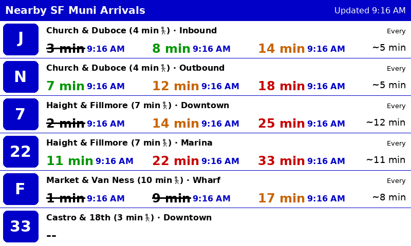

# SFMTA Arrival Time Viewer

Real-time SF Muni arrival times, color-coded by whether you can walk to the stop in time. Runs anywhere Python does — as a PNG generator on your laptop, or on a Raspberry Pi driving an e-ink display.



Shows up to 6 routes across multiple stops:

- **~~Strikethrough~~** — you can't make it
- **Green** — go now, you'll catch it
- **Yellow** — comfortable wait at the stop
- **Red** — long wait

Arrival data comes from the [511.org](https://511.org/open-data) real-time transit API (SIRI StopMonitoring format). Uses a single API call per refresh to stay well within rate limits.

## Requirements

- Python 3.10+
- A free [511.org API key](https://511.org/open-data/token)
- **Optional:** Any Raspberry Pi with a GPIO header + [Pimoroni Inky Impression 7.3"](https://shop.pimoroni.com/products/inky-impression-7-3) e-ink display (tested on Pi Zero 2 W)

## Quick Start (macOS / Linux)

```bash
git clone https://github.com/ehjacobs/sfmta-arrivals.git
cd sfmta-arrivals

python3 -m venv .venv
source .venv/bin/activate
pip install -r requirements.txt

# Render test data (no API key needed)
make test
open example.png

# Use live data
cp config.example.yaml config.yaml
# Edit config.yaml with your API key and stops
make dev
```

## Configuration

Copy `config.example.yaml` to `config.yaml` and edit:

```yaml
api_key: "YOUR_511_API_KEY"
agency: "SF"
refresh_interval_minutes: 2

stops:
  - stop_code: "15553"        # from 511.org stop list
    name: "Church & Duboce"
    walk_minutes: 4            # your walking time to this stop
    routes:
      - line: "J"
        direction: "Balboa Park"   # substring match on DestinationName from API
        display_name: "Outbound"   # shown on display (optional, defaults to direction)
      - line: "N"
        direction: "Ocean Beach"
        display_name: "Outbound"
  - stop_code: "13915"
    name: "Haight & Fillmore"
    walk_minutes: 7
    routes:
      - line: "7"
        direction: "Noriega"
        display_name: "Outbound"
      - line: "22"
        direction: "Bay St"
        display_name: "Marina"

thresholds:                    # minutes of buffer after walk time
  rush_max: 0                  # buffer <= 0 → can't make it (strikethrough)
  ideal_max: 5                 # buffer 0-5 → go now (green)
  medium_max: 10               # buffer 5-10 → comfortable (yellow)
                               # buffer > 10 → long wait (red)

display:
  simulate: true               # true = save PNG, false = Inky hardware
  output_path: "output.png"
  saturation: 0.5              # Inky color saturation
  rotation: 0                  # 0, 90, 180, 270
```

**Finding stop codes:** Search for your stop on [511.org](https://511.org/) or use the GTFS stops.txt for the SF agency. You can also use the lookup tool to see what routes serve a stop: `python -m src.lookup --stop 15553`

**Direction matching:** The `direction` field is matched as a substring against the vehicle's `DestinationName` from the API. These are real street names (e.g., `"Steuart St & Mission St"`), not generic labels like "Inbound". Use the lookup tool to find the right values:

```bash
# Show destinations for a route
python -m src.lookup --route J

# Show all routes and destinations at a stop
python -m src.lookup --stop 15553

# List all currently active routes
python -m src.lookup --routes
```

## Raspberry Pi Setup

### Hardware

1. Raspberry Pi with a GPIO header (tested on Pi Zero 2 W; most models should work)
2. [Pimoroni Inky Impression 7.3"](https://shop.pimoroni.com/products/inky-impression-7-3) (800x480, 7-color e-ink)
3. Mount the display on the Pi's GPIO header

### Installation

```bash
# Clone the repo on the Pi
git clone https://github.com/ehjacobs/sfmta-arrivals.git
cd sfmta-arrivals

# Run the install script (installs deps, enables SPI/I2C, sets up systemd)
bash deploy/install.sh

# Create your config
cp config.example.yaml config.yaml
nano config.yaml
# Set your API key, stops, and display.simulate to false
```

### Start the service

```bash
sudo systemctl start sfmta-arrivals

# Check it's running
journalctl -u sfmta-arrivals -f

# It will auto-start on boot
```

### Deploy updates

SSH into your Pi (e.g., via [Raspberry Pi Connect](https://www.raspberrypi.com/software/connect/)) and pull the latest code:

```bash
cd ~/sfmta-arrivals
git pull
sudo systemctl restart sfmta-arrivals
```

## Development

```bash
make test          # render test data to example.png (no API key needed)
make dev           # fetch live data, render to output.png
```

## How It Works

- Makes a single API call to 511.org's StopMonitoring endpoint per refresh (no stop code filter), then filters locally to your configured stops and routes
- At the default 2-minute refresh interval, this uses ~30 API calls/hour (limit is 60/hour)
- Frequency is calculated by averaging gaps across all available upcoming arrivals, smoothing out bus bunching
- The 7-color e-ink display takes ~25 seconds for a full refresh (no partial refresh on these panels)

## Disclaimer

This is an independent personal project. It is not affiliated with, endorsed by, or associated with SFMTA, SF Muni, or 511.org.

## License

[MIT](LICENSE). DejaVu fonts are bundled under their own [permissive license](fonts/LICENSE).
